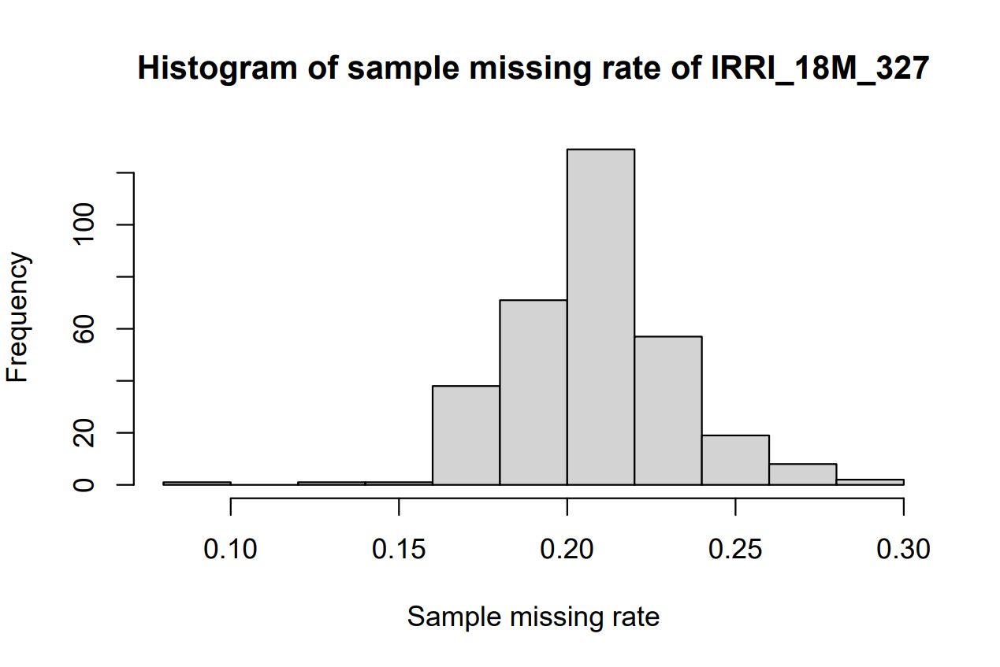
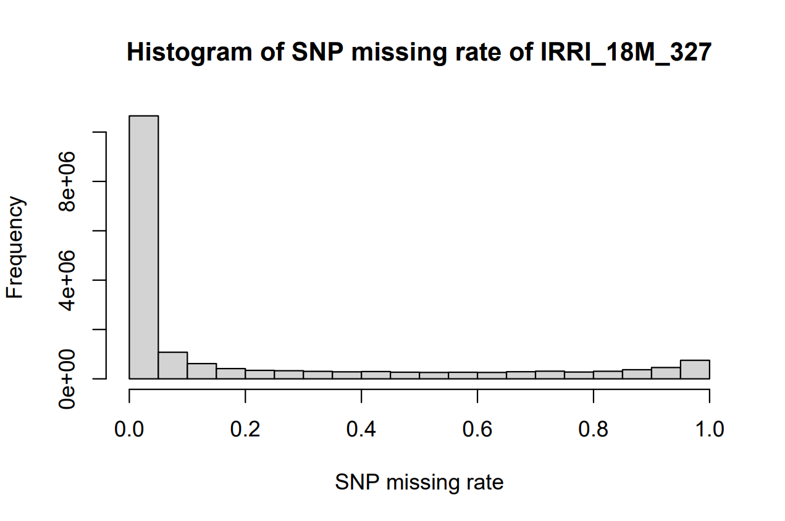
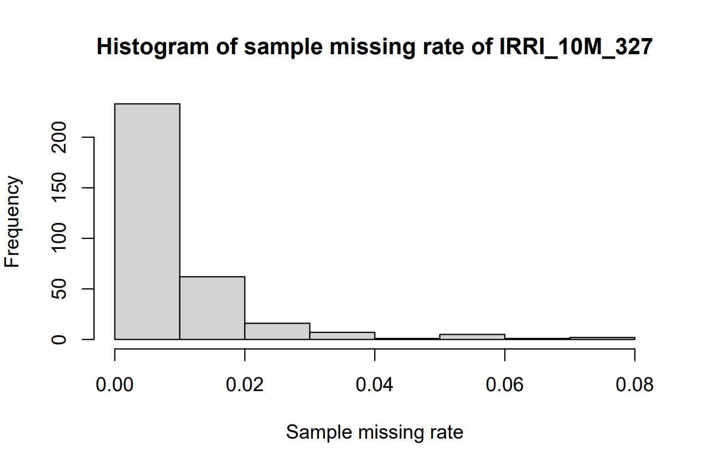
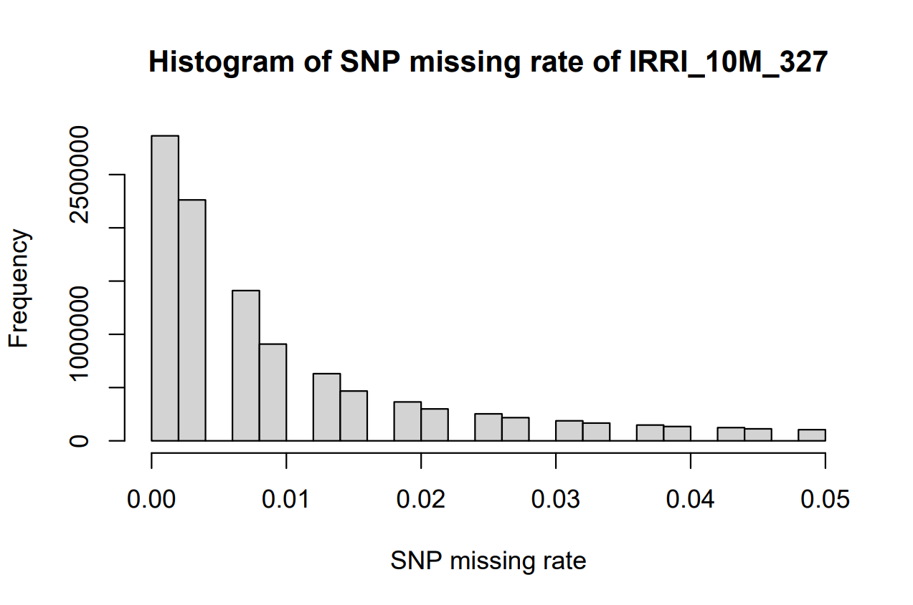
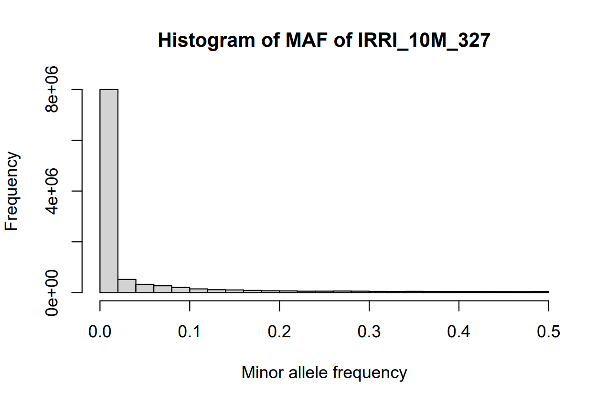
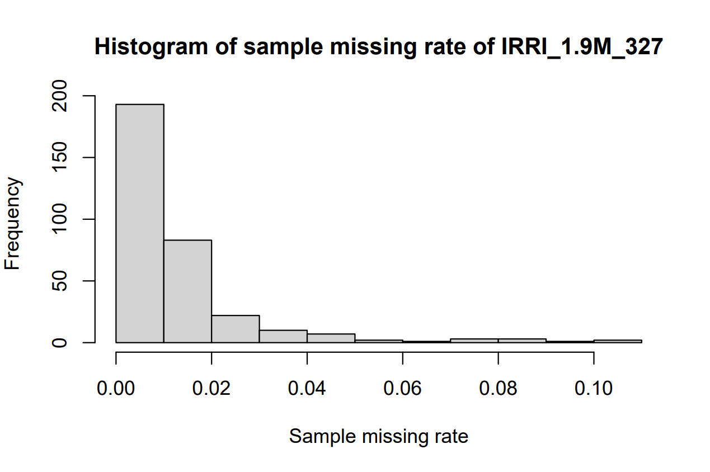
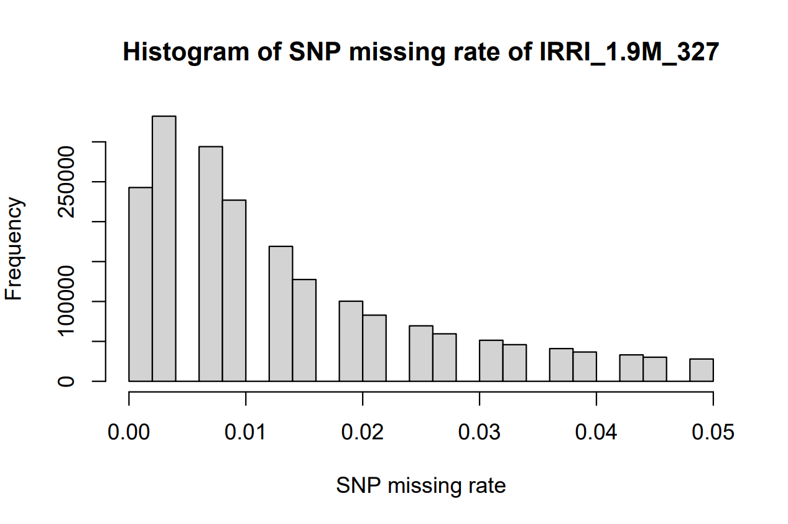

# Genotype Data {#sec-genotype-data}

```{block, type = "rmdtip"}
In this chapter, we focus on constructing the genotypic dataset from SNP-Seek (3K Rice Genome). We begin by downloading the relevant SNP data, ensuring that sample identifiers align correctly with phenotypic dataset. Next, we perform quality control steps—such as filtering out low-quality SNPs and removing problematic samples—to obtain a robust set of markers suitable for GWAS. The resulting, cleaned genotype data forms the foundation for subsequent analyses presented in later chapters.
```

1.  **Download Rice SNP data from SNP-Seek (3K RG)**

2.  **Align Accession IDs**

3.  **SNP Data Processing and Quality Control**

4.  **Generate Final Genotypic data**

## **Download Rice SNP data from SNP-Seek (3K RG)**

Data repository for the 3K RG, hosted by IRRI:
[https://snpseekv3.irri-e-extension.com/v2/download.zul](https://snpseekv3.irri-e-extension.com/v2/_download.zul){.uri}

-   **3K RG 18mio Base SNP Dataset:** A base SNP set consisting of
    approximately 18 million SNPs was derived from the initial \~29
    million biallelic SNPs by excluding those with an excessive number
    of heterozygous calls.

-   [**Mapping
    table**](https://3kricegenome.s3.us-east-1.amazonaws.com/kaust_irri_3k_16refs/3K_list_sra_ids.txt)**:**
    NCBI SRA accession IDs to 3K RG assay IDs.

Please download the PLINK `.bed`, `.bim`, and `.fam` files for **3K RG
18mio Base SNP Dataset**. After downloading, extract the files and
rename them as ``` IRRI_18M_3024``.bed ```, `IRRI_18M_3024.bim`, and
`IRRI_18M_3024.fam` files. Also, download and save the [**Mapping
table**](https://3kricegenome.s3.us-east-1.amazonaws.com/kaust_irri_3k_16refs/3K_list_sra_ids.txt)
in a `.csv` file for reference.

```{block, type = "rmdnote"}
The reference genome for these datasets is 'Nipponbare MSU7/IRGSP1.0'.
```

## **Align Accession IDs**

Match the accession IDs between the phenotypic data and SNP datasets. We
identified three issues related to inconsistencies in the spelling,
formatting, and ranking of ID names between the phenotype and genotype
data: (1) The ID names in the phenotype data must correspond precisely
with those in the genotype datasets, using the Mapping Table as a
reference. (2) The format of ID names in the Mapping Table is
inconsistent with the format used in the phenotype data. (3) In the
genotype data, the rank order of ID names does not follow the correct
sequence. For example, the correct order should be: `IRIS_313-8890`,
`IRIS_313-9101`, and `IRIS_313-11657`, not `IRIS_313-11657`,
`IRIS_313-8890`, and `IRIS_313-9101`.

<details>

<summary>**R** ➡️ **Align and match ID names**</summary>

**Input:**

-   **Pheno_327_unranked.csv**

``` r
##### R CODES #####

# Set the working directory
setwd("...your file path...")

# Load the phenotypic data from IRRI
Pheno_327_unranked = read.csv("Pheno_327_unranked.csv") 

which(Pheno_327_unranked$DNA_ID == "IRIS_313-7620") # 253
which(Pheno_327_unranked$DNA_ID == "IRIS_313-9989") # 327
which(Pheno_327_unranked$DNA_ID == "IRIS_313-10020") # 5
which(Pheno_327_unranked$DNA_ID == "IRIS_313-15902") # 252

# Rearrange the data frame to exclude specific entries
Pheno_327_ranked = Pheno_327_unranked[c(1:4, 253:327, 5:252), ]

# Save the sorted and rearranged data frame to a CSV file
write.csv(Pheno_327_ranked, "Pheno_327_ranked.csv", row.names = F)

# Export a text file with the IDs for further analysis
write.table(cbind(Pheno_327_ranked$DNA_ID, Pheno_327_ranked$DNA_ID), "Pheno_327_ID.txt", row.names = F, col.names = F, quote = F)
```

**Outputs:**

-   **Pheno_327_ranked.csv**\
    Phenotypic data that has been sorted and reorganized.

-   **Pheno_327_ID.txt**\
    A text file containing the list of IDs.

</details>

------------------------------------------------------------------------

## SNP Data Processing and Quality Control

Perform data generation and quality control on the SNP data for the
subset of 327 samples. Starting with the 3K Rice Genome 18 million SNP
dataset (IRRI_18M_3024), the dataset is filtered for missingness,
reducing it to 10 million SNPs, and further refined based on minor
allele frequency (MAF) to approximately 1.9 million high-quality SNPs,
ready for GWAS.

<details>

<summary>**R/PLINK** ➡️ **STEP 1: Extracting samples** **(IRRI_18M_3024
→** **IRRI_18M_327)**</summary>

``` r
##### PLINK COMMANDS #####  

# Change your path into the directory of the '3K RG 18mio Base SNP Dataset (IRRI_18M_3024)' 
cd ...your file path...

# Subset dataset to include 327 individuals with phenotype and genotype 
./plink --bfile IRRI_18M_3024 --keep Pheno_327_ID.txt --make-bed --noweb --allow-no-sex --out IRRI_18M_327
# --keep: Retain specific samples
```

------------------------------------------------------------------------

</details>

<details>

<summary>**R/PLINK** ➡️ **STEP 2:** **QC for SNP missingness**
**(IRRI_18M_327 → IRRI_10M_327)**</summary>

``` r
##### PLINK COMMANDS #####

./plink --bfile IRRI_18M_327 --missing
# --missing: Calculate SNP and sample missing rates  
# Changes the outcome's filenames into IRRI_18M_327.lmiss and IRRI_18M_327.imiss 
```

``` r
##### R CODES #####

# Set the working directory
setwd("...your file path...")

# Visualize SNP missing rates
library(data.table)
SNP_miss = fread("IRRI_18M_327.lmiss")
summary(SNP_miss$F_MISS)
hist(SNP_miss$F_MISS, main = "Histogram of SNP missing rate of IRRI_18M_327", xlab = "SNP missing rate") 

# Visualize sample missing rates
Sample_miss = fread("IRRI_18M_327.imiss")
summary(Sample_miss$F_MISS)
hist(Sample_miss$F_MISS, main = "Histogram of sample missing rate of IRRI_18M_327", xlab = "Sample missing rate") 

# Identify SNPs with high missing rates
loc = which(SNP_miss$F_MISS >= 0.05)
remove_SNP_list = SNP_miss[loc, 2]
dim(SNP_miss)[1]-dim(remove_SNP_list)[1] # SNPs passing filters
write.table(remove_SNP_list, "remove_SNP_list_miss_IRRI_18M_327.txt", row.names = F, col.names = F, quote = F)
```

{width="400"}

{width="400"}

``` r
##### PLINK COMMANDS #####  

./plink --bfile IRRI_18M_327 --exclude remove_SNP_list_miss_IRRI_18M_327.txt --make-bed --noweb --allow-no-sex --out IRRI_10M_327   
# --exclude: Remove SNPs with high missing rate
# -> 10617659 variants and 327 people pass filters and QC  
```

``` r
##### PLINK COMMANDS #####   

./plink --bfile IRRI_10M_327 --missing
# --missing: calculate SNP and sample missing rates 
# Changes the outcome's filenames into IRRI_10M_327.lmiss and IRRI_10M_327.imiss
```

``` r
##### R CODES #####    

# Check the sample missing rates for the filtered data 
Sample_miss = fread("IRRI_10M_327.imiss") 
summary(Sample_miss$F_MISS)
hist(Sample_miss$F_MISS, main = "Histogram of sample missing rate of IRRI_10M_327", xlab = "Sample missing rate") 

# Check the SNP missing rates for the filtered data 
SNP_miss = fread("IRRI_10M_327.lmiss") 
summary(SNP_miss$F_MISS)
hist(SNP_miss$F_MISS, main = "Histogram of SNP missing rate of IRRI_10M_327", xlab = "SNP missing rate") 
```

{width="400"}

{width="400"}

------------------------------------------------------------------------

</details>

<details>

<summary>**R/PLINK** ➡️ **STEP 3: QC for SNP MAF (IRRI_10M_327 →
IRRI_1.9M_327)**</summary>

``` r
##### PLINK COMMANDS #####  

./plink --bfile IRRI_10M_327 --freq   
# --freq: calculate SNP's allele frequency
```

``` r
##### R CODES #####  

# Visualize minor allele frequency
frq_data = fread("IRRI_10M_327.frq") # Load frequency data
summary(frq_data$MAF)
hist(frq_data$MAF, main = "Histogram of MAF of IRRI_10M_327", xlab = "Minor allele frequency")

# Identify SNPs with low MAF
loc = which(frq_data$MAF < 0.05)
remove_SNP_list = frq_data[loc, 2]
dim(frq_data)[1]-dim(remove_SNP_list)[1] # SNPs passing filters
write.table(remove_SNP_list, "remove_SNP_list_maf_IRRI_10M_327.txt", row.names = F, col.names = F, quote = F)
```

{width="400"}

``` r
##### PLINK COMMANDS #####      

./plink --bfile IRRI_10M_327 --exclude remove_SNP_list_maf_IRRI_10M_327.txt --make-bed --noweb --allow-no-sex --out IRRI_1.9M_327 
# -> 1972824 variants and 327 people pass filters and QC
```

``` r
##### PLINK COMMANDS #####     

./plink --bfile IRRI_1.9M_327 --missing   
./plink --bfile IRRI_1.9M_327 --freq  
# Changes the outcome's filenames into IRRI_1.9M_327.lmiss, IRRI_1.9M_327.imiss and IRRI_1.9M_327.frq
```

``` r
##### R CODES #####  

# Check data quality metrics: missing rate and MAF

# Visualize sample missing rates for the final data
Sample_miss = fread("IRRI_1.9M_327.imiss")
summary(Sample_miss$F_MISS)
hist(Sample_miss$F_MISS, main = "Histogram of sample missing rate of IRRI_1.9M_327", xlab = "Sample missing rate")

# Visualize SNP missing rates for the final data
SNP_miss = fread("IRRI_1.9M_327.lmiss")
summary(SNP_miss$F_MISS)
hist(SNP_miss$F_MISS, main = "Histogram of SNP missing rate of IRRI_1.9M_327", xlab = "SNP missing rate")

# Visualize MAF for the final data
frq_data = fread("IRRI_1.9M_327.frq")
summary(frq_data$MAF)
hist(frq_data$MAF, main = "Histogram of MAF of IRRI_1.9M_327", xlab = "Minor allele frequency")
```

{width="400"}

{width="400"}

{width="400"}

------------------------------------------------------------------------

</details>

------------------------------------------------------------------------

## **Generate Final Genotypic data**

Prepare the final genotypic data for GWAS analysis. We now need to
convert the QC-passed SNP data in PLINK format (`.bed`, `.bim`, and
`.fam`) into HapMap format, compatible with the GAPIT package.

<details>

<summary>**PLINK** ➡️ **STEP1: Converting PLINK `bfile` into VCF
file**</summary>

``` r
##### PLINK COMMANDS #####

# Change your path into the directory of the 'IRRI_1.9M_327'
# cd ...your file path...
./plink --bfile IRRI_1.9M_327 --recode vcf --out IRRI_1.9M_327
```

</details>

<details>

<summary>**R** ➡️ **STEP2: Converting VCF into HapMap file and store in
RDS format**</summary>

``` r
##### R CODES #####

# Set the working directory
setwd("...your file path...")

library(vcfR)
vcfR = read.vcfR(
  "IRRI_1.9M_327.vcf",
  limit = 1e+50,
  nrows = -1,
  skip = 0,
  cols = NULL,
  convertNA = TRUE,
  checkFile = TRUE,
  check_keys = TRUE,
  verbose = TRUE)

HapMap = vcfR2hapmap(vcfR_test)
class(HapMap)

write.table(HapMap,
            file = "IRRI_1.9M_327.hmp.txt",
            sep = "\t",
            row.names = FALSE,
            col.names = FALSE)

Geno = read.table("IRRI_1.9M_327.hmp.txt", head = FALSE)
saveRDS(Geno, "Geno.rds") # Final data for GWAS
```

</details>

------------------------------------------------------------------------

We have prepared a genotypic data for GWAS analysis, including 327
samples and 1.9 million SNPs.
