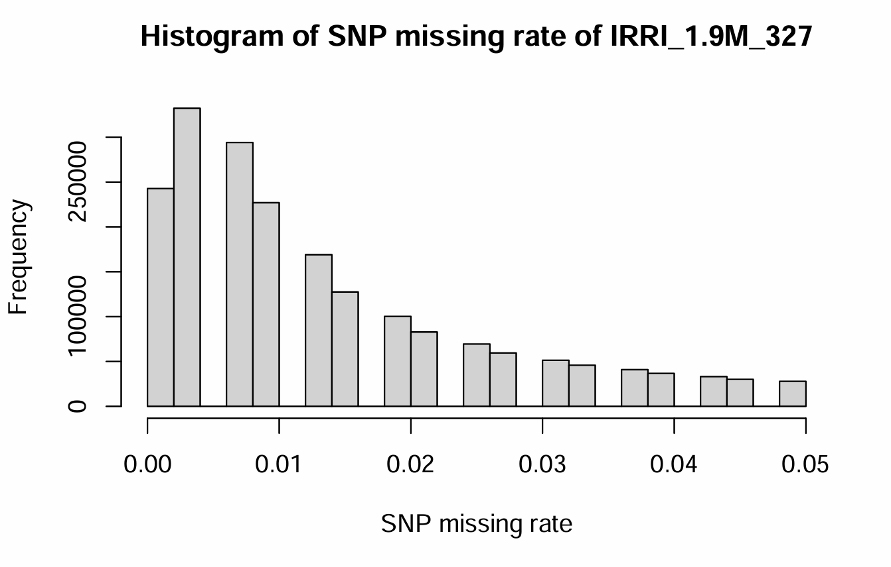
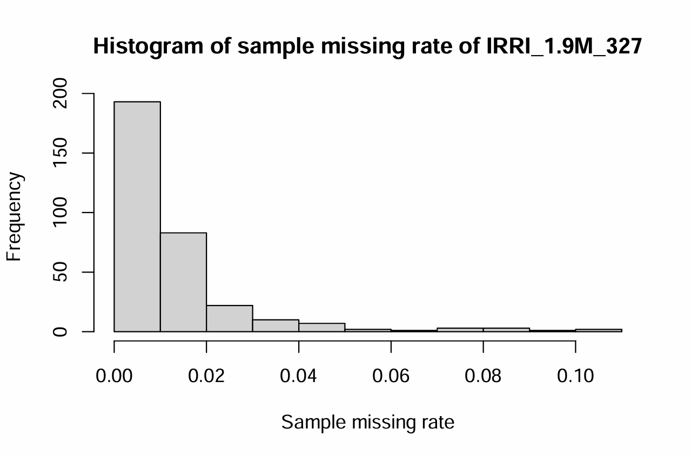
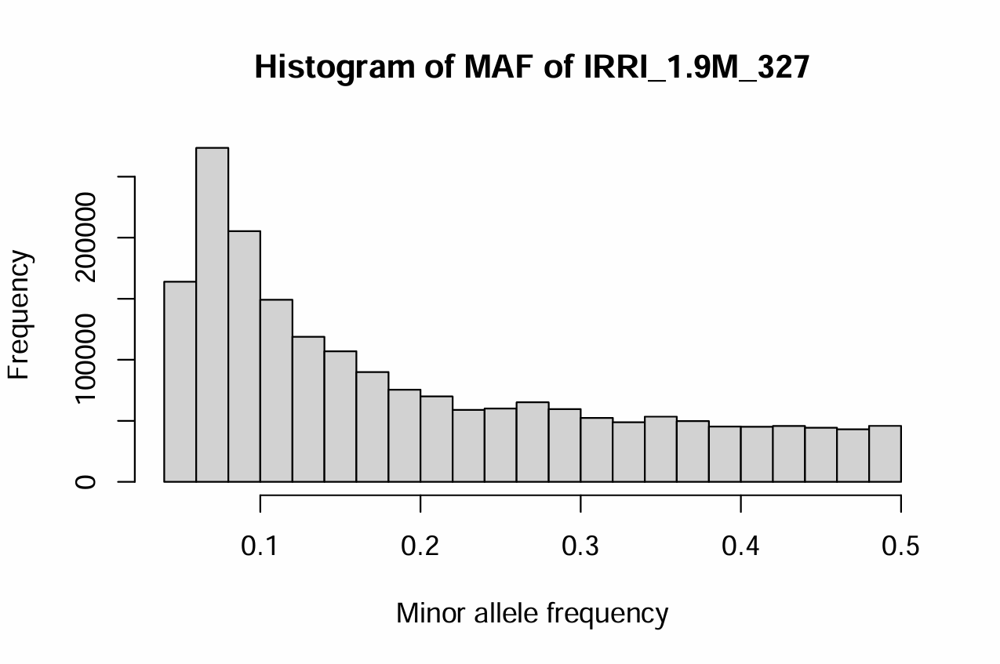
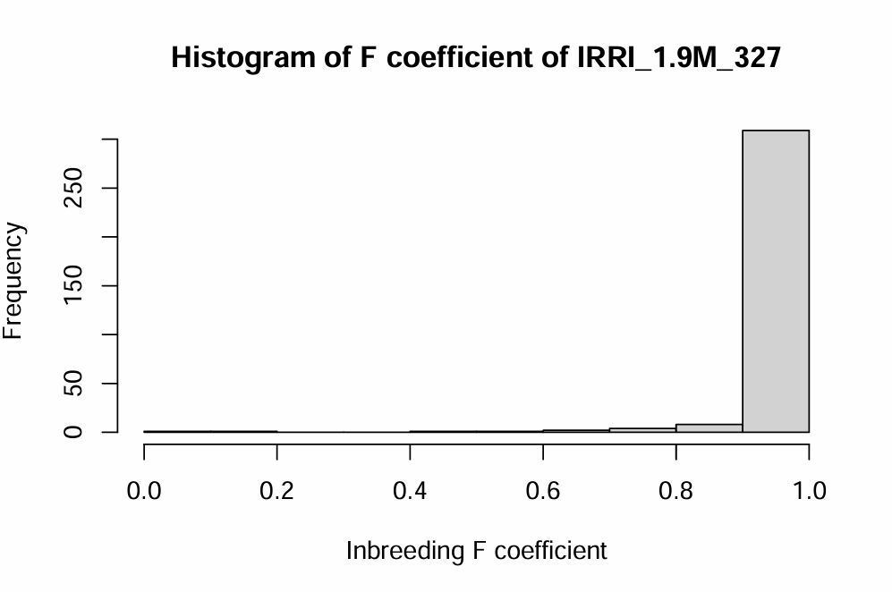

# Genotype Data {#sec-genotype-data}

1.  **Download Rice SNP data from SNP-Seek (3K RG)**

2.  **Align Accession IDs**

3.  **SNP Data Processing and Quality Control**

4.  **Generate Final Genotypic data**

## **Download Rice SNP data from SNP-Seek (3K RG)**

Data repository for the 3K RG, hosted by IRRI:
[https://snpseekv3.irri-e-extension.com/v2/download.zul](https://snpseekv3.irri-e-extension.com/v2/_download.zul){.uri}

We utilized the [3K RG 18 million Base SNP Dataset]{.underline} and the
[3K RG 404k Core SNP Dataset]{.underline}:

-   **3K RG 18mio Base SNP Dataset:** A base SNP set consisting of
    approximately 18 million SNPs was derived from the initial \~29
    million biallelic SNPs by excluding those with an excessive number
    of heterozygous calls.

-   **3K RG 404k CoreSNP Dataset:** The Core SNP set was derived from
    the filtered SNP set through a two-step LD pruning procedure.

-   [**Mapping
    table**](https://3kricegenome.s3.us-east-1.amazonaws.com/kaust_irri_3k_16refs/3K_list_sra_ids.txt)**:**
    NCBI SRA accession IDs to 3K RG assay IDs.

Please download the PLINK `.bed`, `.bim`, and `.fam` files for the two
datasets. After downloading, extract the files and rename them as
`IRRI_18M_3024` and `IRRI_404K_3024`. Also, download and save the
[**Mapping
table**](https://3kricegenome.s3.us-east-1.amazonaws.com/kaust_irri_3k_16refs/3K_list_sra_ids.txt)
in a `.csv` file for reference.

```{block, type = "rmdnote"}
The reference genome for these datasets is 'Nipponbare MSU7/IRGSP1.0'.
```

## **Align Accession IDs**

Match the accession IDs between the phenotypic data and SNP datasets. We
identified three issues related to inconsistencies in the spelling,
formatting, and ranking of ID names between the phenotype and genotype
data:

1.  The ID names in the phenotype data must correspond precisely with
    those in the genotype datasets, using the Mapping Table as a
    reference.

2.  The format of ID names in the Mapping Table is inconsistent with the
    format used in the phenotype data. For example, consider a sample
    named `EX WUKARI (WILD)::IRGC 63214-3`:

    | ID in Phenotype | ID in [Mapping Table](https://3kricegenome.s3.us-east-1.amazonaws.com/kaust_irri_3k_16refs/3K_list_sra_ids.txt) | ID in Genotype |
    |------------------------|------------------------|------------------------|
    | EX WUKARI (WILD)::IRGC 63214-3 | EX_WUKARI\_(WILD)::IRGC_63214-1 | IRIS_313-11657 |
    |  | IRIS_313-11657 |  |

3.  In the genotype data, the rank order of ID names does not follow the
    correct sequence. For example, the correct order should be:
    `IRIS_313-8890`, `IRIS_313-9101`, and `IRIS_313-11657`, not
    `IRIS_313-11657`, `IRIS_313-8890`, and `IRIS_313-9101`.

<details>

<summary>➡️ **Working on R (RStudio)**</summary>

**Input: Pheno_327_unranked.csv**\
Annotated phenotypic data with aligned and matched ID names.

``` r
##### R CODES #####

# Set the working directory
setwd("...your file path...")

# Load the phenotypic data from IRRI
Pheno_327_unranked = read.csv("Pheno_327_unranked.csv") 

which(Pheno_327_unranked$DNA_ID == "IRIS_313-7620") # 253
which(Pheno_327_unranked$DNA_ID == "IRIS_313-9989") # 327
which(Pheno_327_unranked$DNA_ID == "IRIS_313-10020") # 5
which(Pheno_327_unranked$DNA_ID == "IRIS_313-15902") # 252

# Rearrange the data frame to exclude specific entries
Pheno_327_ranked = Pheno_327_unranked[c(1:4, 253:327, 5:252), ]

# Save the sorted and rearranged data frame to a CSV file
write.csv(Pheno_327_ranked, "Pheno_327_ranked.csv", row.names = F)

# Export a text file with the IDs for further analysis
write.table(cbind(Pheno_327_ranked$DNA_ID, Pheno_327_ranked$DNA_ID), "Pheno_327_ID.txt", row.names = F, col.names = F, quote = F)
```

</details>

<details>

<summary>**Outputs**</summary>

-   **Pheno_327_ranked.csv**\
    Phenotypic data that has been sorted and reorganized.

-   **Pheno_327_ID.txt**\
    A text file containing the list of IDs.

</details>

------------------------------------------------------------------------

## SNP Data Processing and Quality Control

Perform data generation and quality control on the SNP data for the
subset of 327 samples. Starting with the 3K Rice Genome 18 million SNP
dataset (IRRI_18M_3024), the dataset is filtered for missingness,
reducing it to 10 million SNPs, and further refined based on minor
allele frequency (MAF) to approximately 1.9 million high-quality SNPs,
ready for GWAS.

<details>

<summary>➡️ **Working on PLINK in the terminal**</summary>

``` r
##### PLINK COMMANDS #####  

# Change your path into the directory of the '3K RG 18mio Base SNP Dataset (IRRI_18M_3024)' 
cd ...your file path...  

# Subset dataset to include 327 individuals with phenotype and genotype 
./plink --bfile IRRI_18M_3024 --keep Pheno_327_ID.txt --make-bed --noweb --allow-no-sex --out IRRI_18M_327
# --keep: Retain 327 samples with Phenotype and Genotype  

./plink --bfile IRRI_18M_327 --missing 
# --missing: Calculate SNP missing rates 
# Changes the outcome's filenames into IRRI_18M_327.lmiss and IRRI_18M_327.imiss.  
# Create a new data after removing SNPs with high missing rates 

./plink --bfile IRRI_18M_327 --exclude remove_SNP_list_miss_IRRI_18M_327.txt --make-bed --noweb --allow-no-sex --out IRRI_10M_327 
# -> 10617659 variants and 327 people pass filters and QC 
./plink --bfile IRRI_10M_327 --missing 
# Changes the outcome's filenames into IRRI_10M_327.lmiss and IRRI_10M_327.imiss. 
./plink --bfile IRRI_10M_327 --freq  
# Create a new data after removing SNPs with low MAF 

./plink --bfile IRRI_10M_327 --exclude remove_SNP_list_maf_IRRI_10M_327.txt --make-bed --noweb --allow-no-sex --out IRRI_1.9M_327
# -> 1972824 variants and 327 people pass filters and QC 
./plink --bfile IRRI_1.9M_327 --missing 
./plink --bfile IRRI_1.9M_327 --freq ./plink --bfile IRRI_1.9M_327 --het 
# Changes the outcome's filenames into IRRI_1.9M_327.lmiss, IRRI_1.9M_327.imiss, IRRI_1.9M_327.frq and IRRI_1.9M_327.het.
```

</details>

<details>

<summary>➡️ **Working on R (RStudio)**</summary>

``` r
##### R CODES #####

# Set the working directory
setwd("...your file path...")

# Remove SNPs with a high missing rate (retain SNPs with missing rate ≤ 0.05)
library(data.table)
SNP_miss = fread("IRRI_18M_327.lmiss")
hist(SNP_miss$F_MISS, main = "Histogram of SNP missing rate of IRRI_18M_327", xlab = "SNP missing rate") # Visualize SNP missing rate
summary(SNP_miss$F_MISS)

# Calculate and visualize sample missing rates
Sample_miss = fread("IRRI_18M_327.imiss")
hist(Sample_miss$F_MISS, main = "Histogram of sample missing rate of IRRI_18M_327", xlab = "Sample missing rate") # Visualize sample missing rate
summary(Sample_miss$F_MISS)

# Identify and remove SNPs with high missing rates
loc = which(SNP_miss$F_MISS >= 0.05)
remove_SNP_list = SNP_miss[loc, 2]
dim(SNP_miss)[1]-dim(remove_SNP_list)[1] # SNPs passing filters
write.table(remove_SNP_list, "remove_SNP_list_miss_IRRI_18M_327.txt", row.names = F, col.names = F, quote = F)

# Calculate SNP missing rates for the filtered data
SNP_miss = fread("IRRI_10M_327.lmiss")
hist(SNP_miss$F_MISS, main = "Histogram of SNP missing rate of IRRI_10M_327", xlab = "SNP missing rate") # Visualize SNP missing rate
summary(SNP_miss$F_MISS)

# Calculate and visualize sample missing rates for the filtered data
Sample_miss = fread("IRRI_10M_327.imiss")
hist(Sample_miss$F_MISS, main = "Histogram of sample missing rate of IRRI_10M_327", xlab = "Sample missing rate") # Visualize sample missing rate
summary(Sample_miss$F_MISS)

# Remove SNPs with minor allele frequency (MAF) < 0.05
frq_data = fread("IRRI_10M_327.frq") # Load frequency data
hist(frq_data$MAF, main = "Histogram of MAF of IRRI_10M_327", xlab = "Minor allele frequency") # Visualize MAF
summary(frq_data$MAF)

# Identify and remove SNPs with low MAF
loc = which(frq_data$MAF < 0.05)
remove_SNP_list = frq_data[loc, 2]
dim(frq_data)[1]-dim(remove_SNP_list)[1] # SNPs passing filters
write.table(remove_SNP_list, "remove_SNP_list_maf_IRRI_10M_327.txt", row.names = F, col.names = F, quote = F)

# Check data quality metrics: missing rate, MAF, inbreeding F, and HWE
# Calculate and visualize SNP missing rates for the final data
SNP_miss = fread("IRRI_1.9M_327.lmiss")
hist(SNP_miss$F_MISS, main = "Histogram of SNP missing rate of IRRI_1.9M_327", xlab = "SNP missing rate")
summary(SNP_miss$F_MISS)

# Calculate and visualize sample missing rates for the final data
Sample_miss = fread("IRRI_1.9M_327.imiss")
hist(Sample_miss$F_MISS, main = "Histogram of sample missing rate of IRRI_1.9M_327", xlab = "Sample missing rate")
summary(Sample_miss$F_MISS)

# Calculate and visualize MAF for the final data
frq_data = fread("IRRI_1.9M_327.frq")
hist(frq_data$MAF, main = "Histogram of MAF of IRRI_1.9M_327", xlab = "Minor allele frequency")
summary(frq_data$MAF)

# Calculate and visualize inbreeding coefficient (F) for the final data
het_data = fread("IRRI_1.9M_327.het")
hist(het_data$F, main = "Histogram of F coefficient of IRRI_1.9M_327", xlab = "Inbreeding F coefficient")
summary(het_data$F)
```

</details>

<details>

<summary>**Outputs**</summary>

1.  Histogram of SNP missing rate of IRRI_1.9M_327

    {width="400"}

2.  Histogram of sample missing rate of IRRI_1.9M_327

    {width="400"}

3.  Histogram of MAF of IRRI_1.9M_327

    {width="400"}

4.  Histogram of F coefficient of IRRI_1.9M_327

    {width="400"}

</details>

------------------------------------------------------------------------

## **Generate Final Genotypic data**

Prepare the final genotypic data for GWAS analysis. We now need to
convert the QC-passed SNP data in PLINK format (`.bed`, `.bim`, and
`.fam`) into HapMap format, compatible with the GAPIT package.

<details>

<summary>➡️ **Working on PLINK in the terminal**</summary>

``` r
##### PLINK COMMANDS #####

# Change your path into the directory of the 'IRRI_1.9M_327'
# cd ...your file path...
./plink --bfile IRRI_1.9M_327 --recode vcf --out IRRI_1.9M_327
```

</details>

<details>

<summary>➡️ **Working on R (RStudio)**</summary>

``` r
##### R CODES #####

# Set the working directory
setwd("...your file path...")

library(vcfR)
vcfR = read.vcfR(
  "IRRI_1.9M_327.vcf",
  limit = 1e+50,
  nrows = -1,
  skip = 0,
  cols = NULL,
  convertNA = TRUE,
  checkFile = TRUE,
  check_keys = TRUE,
  verbose = TRUE)

HapMap = vcfR2hapmap(vcfR_test)
class(HapMap)

write.table(HapMap,
            file = "IRRI_1.9M_327.hmp.txt",
            sep = "\t",
            row.names = FALSE,
            col.names = FALSE)

Geno = read.table("IRRI_1.9M_327.hmp.txt", head = FALSE)
saveRDS(Geno, "Geno.rds") # Final data for GWAS
```

</details>

------------------------------------------------------------------------

We have prepared a genotypic data for GWAS analysis, including 327
samples and 1.9 million SNPs.
