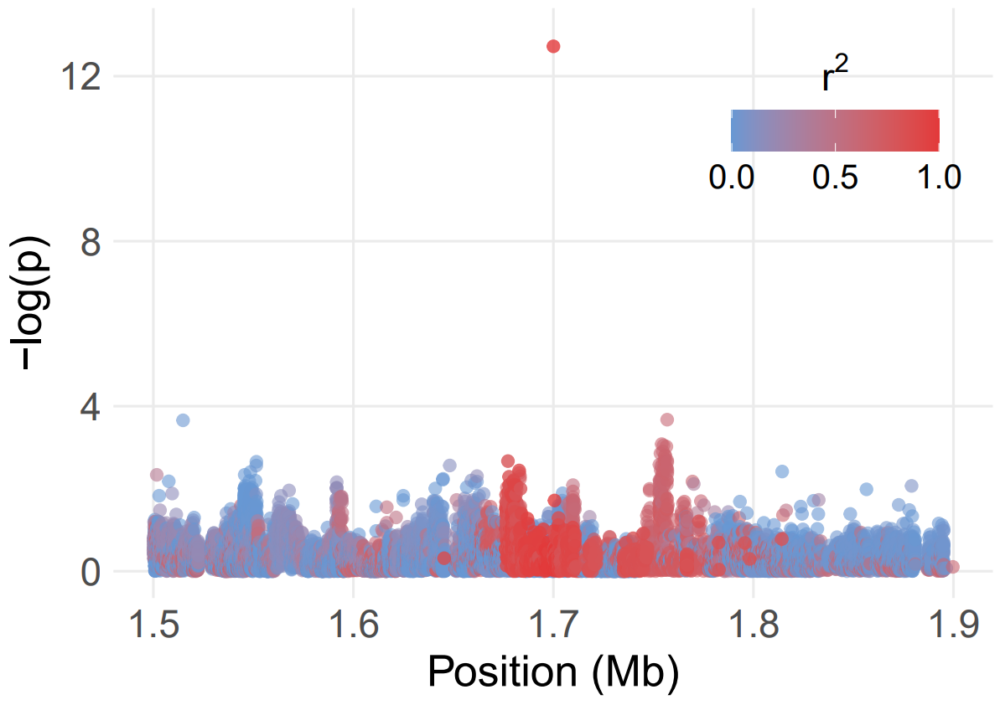
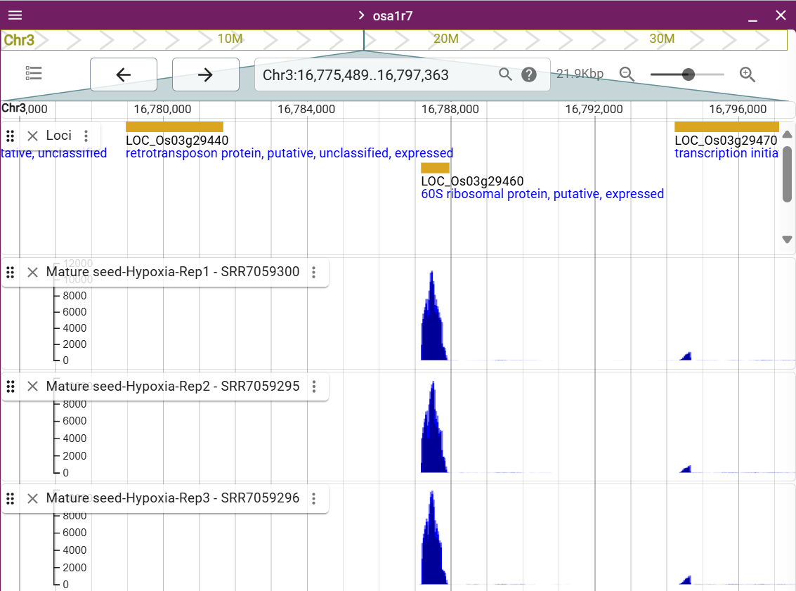

# Post-GWAS {#sec-post-gwas}

```{block, type = "rmdtip"}
This chapter will delve into post-GWAS analyses that further dissect and validate the significant associations identified in the GWAS. Potential steps include fine-mapping of loci, candidate gene exploration, functional annotation, and predictive modeling. These complementary investigations aim to clarify the biological relevance of the discovered markers and move us closer to practical applications in breeding or further research.
```

**Three significant SNPs based on BLINK model with `PCA.total = 5`:**

-   **Chr03: 17005606 (SNP ID: 96208338)**

-   **Chr03: 32521809 (SNP ID: 111729982)**

-   **Chr10: 15162418 (SNP ID: 308650519)**

1.  Use the significant SNPs detected by BLINK with `PCA.total = 5` to
    pinpoint regions associated with seed germination.

2.  Also, consider the linkage disequilibrium (LD) decay rate in
    population to define the size of the candidate genomic region around
    each significant SNP. **-\> [Click
    Here!](https://teddyenn.github.io/GWAS_RICE/sec-extra.html#linkage-disequilibrium-ld-decay-across-genome)**

3.  Examine local LD structure (e.g., haplotype blocks) to ensure the
    identified region is accurately confined to areas of strong linkage.

4.  Use external resources, databases, and literature to explore known
    genes, QTLs, or functional annotations within these candidate
    genomic region.

5.  Determine the favorable alleles of each significant SNP or haplotype
    and whether it is associated with higher germination under aerobic
    conditions.

## **Chr03: 17005606**

{width="600"}

-   The plot displays the candidate region within 200 Kb (0.2Mb)
    upstream or downstream of significant SNPs (Chr03: 17005606).

-   The *p*-values based on the BLINK model with `PCA.total = 5`.

-   The color of each SNP reflects its LD (*r*^2^) value with the peak
    SNP.

<details>

<summary>**PLINK** ➡️ **STEP 1: Calculating Pairwise LD (r²) around the
Peak SNP**</summary>

``` r
##### PLINK COMMANDS #####     

# Change your path into the directory of the 'IRRI_1.9M_327'   
cd ...your file path...  

# Creat a "Peak_SNP_96208338.txt" file in your path, this txt file only contains the peak SNP ID "96208338".   

# Copy this SNP ID -> 96208338  
# Paste in the -> "Peak_SNP_96208338.txt"  

# Calculating Pairwise LD (r²) around the Peak SNP 
./plink --bfile IRRI_1.9M_327 --set-hh-missing --r2 --ld-snp-list Peak_SNP_96208338.txt --ld-window-r2 0 --ld-window 99999 --ld-window-kb 2000 --out SNP_96208338_LD 

# --set-hh-missing: Converts any genotypes flagged as "heterozygous haploid (hh)" into missing genotypes.  
# --r2: Tells PLINK to compute the pairwise linkage disequilibrium metric r² for the specified SNP(s).  
# --ld-snp-list Peak_SNP_96208338.txt: Reads in a file containing a list of SNP IDs (in this case, it contains the single peak SNP ID 96208338). PLINK will calculate LD between the listed SNP(s) and all other SNPs within the specified windows.  
# --ld-window-r2 0: Sets the minimum r² threshold to "0", meaning no SNPs will be excluded based on r². Essentially, all pairwise LD calculations with the target SNP is performed.  
# --ld-window 99999: Defines the maximum number of SNPs (on each side of the target SNP) to include in the LD calculation. Using a very large number "99999" effectively removes any SNP-count-based restriction.  
# --ld-window-kb 2000: Sets the genomic window size to "2000 kb" around the target SNP. Only SNPs within ±2000 kb of the peak SNP will be considered in the LD calculation. 
# --out SNP_96208338_LD: Specifies the output file prefix. PLINK will produce output files (e.g., SNP_96208338_LD.ld) containing LD statistics.
```

------------------------------------------------------------------------

</details>

<details>

<summary>**PLINK** ➡️ **STEP 2: Extracting a Windowed Subset of
Genotypes around the SNP**</summary>

``` r
##### PLINK COMMANDS #####   

# Change your path into the directory of the 'IRRI_1.9M_327'   
cd ...your file path...  

./plink --bfile IRRI_1.9M_327 --snp 96208338 --window 4000 --make-bed --noweb --allow-no-sex --out IRRI_96208338_327

# --snp 96208338: Specifies the central SNP around which a window of data will be extracted.
# --window 4000: Defines a ±2000 kb window on each side of the SNP (total of "4000" kb) to be extracted for the new dataset.
# --out IRRI_96208338_327: Sets the prefix for the output files generated by this command (e.g., IRRI_96208338_327.bed, .bim, .fam).
```

------------------------------------------------------------------------

</details>

<details>

<summary>**R ➡️ STEP 3: Fine-mapping and Regional Association
Analysis**</summary>

``` r
##### R CODES #####  

# -> Create a folder (e.g. Chr03_17005606)

# Set the working directory 
setwd("...your file path.../Chr03_17005606")  

# Put the GWAS, LD, and windowed subset results into this folder 
# I use the GWAS result based on Blink (PC=5)
# -> GAPIT.Association.Filter_GWAS_results.csv
# -> SNP_96208338_LD.ld
# -> IRRI_96208338_327.bed, .bim, .fam

library(data.table)

# Import GWAS results (BLINK with PCA.total=5)
Blink_PC5 = fread("GAPIT.Association.GWAS_Results.BLINK.Control_AG_14DAS.csv") 
Blink_PC5 = as.data.frame(Blink_PC5)

# Import subset region
Region_96208338 = fread("IRRI_96208338_327.bim")
Region_96208338 = as.data.frame(Region_96208338[, c(1:2, 4)])
colnames(Region_96208338) = c("Chr", "ID", "Pos")

# Import LD file
LD_96208338 = fread("SNP_96208338_LD.ld"); head(LD_96208338); tail(LD_96208338)
LD_96208338 = as.data.frame(LD_96208338)

library(ggplot2)
library(plotly)
library(dplyr)

# Selecting common SNPs and extracting associated values
SNP = intersect(Region_96208338$ID, LD_96208338$SNP_B)
LD_value = LD_96208338[which(LD_96208338$SNP_B %in% SNP), 7]
P_value = Blink_PC5[which(Blink_PC5$SNP %in% SNP), 4]
MAF_value = Blink_PC5[which(Blink_PC5$SNP %in% SNP), 5]
BHadj_P_value = Blink_PC5[which(Blink_PC5$SNP %in% SNP), 7]
Effect_value  = Blink_PC5[which(Blink_PC5$SNP %in% SNP), 8]

# Data wrangling for the region of interest
Chr03_17005606 = Region_96208338 %>%
  mutate(Light = ifelse(Pos >= 17005606-200000 & Pos <= 17005606+200000, "1", "2")) %>%
  mutate(LD = LD_value) %>%
  mutate(pvalue = P_value) %>%
  mutate(MAF = MAF_value) %>%
  mutate(adjP = BHadj_P_value) %>%
  mutate(Effect = Effect_value)

# Plotting with ggplot2
ggplot_obj = ggplot() +
  geom_point(
    data = subset(Chr03_17005606, LD < 0.8),
    aes(
      x = Pos,
      y = -log10(pvalue),
      color = LD,
      text = paste0(
        "Pos: ", Pos,
        "\n-log10(p): ", round(-log10(pvalue), 3),
        "\n-log10(adj. p): ", round(-log10(adjP), 3),
        "\nLD: ", round(LD, 3),
        "\nMAF: ", round(MAF, 3),
        "\nEffect: ", round(Effect, 3)
      )
    ),
    alpha = 0.6, size = 2
  ) +
  geom_point(
    data = subset(Chr03_17005606, LD >= 0.8),
    aes(
      x = Pos,
      y = -log10(pvalue),
      color = LD,
      text = paste0(
        "Pos: ", Pos,
        "\n-log10(p): ", round(-log10(pvalue), 3),
        "\n-log10(adj. p): ", round(-log10(adjP), 3),
        "\nLD: ", round(LD, 3),
        "\nMAF: ", round(MAF, 3),
        "\nEffect: ", round(Effect, 3)
      )
    ),
    alpha = 0.8, size = 2
  ) +
  scale_color_gradient(
    low = "#6798d4",
    high = "#e3393a",
    limits = c(0, 1),
    breaks = c(0.0, 0.5, 1.0),
    labels = c("0.0", "0.5", "1.0")
  ) +
  scale_x_continuous(
    breaks = c(15000000, 16000000, 17000000, 18000000, 19000000),
    labels = c("1.5", "1.6", "1.7", "1.8", "1.9")
  ) +
  scale_y_continuous(limits = c(0, 13), breaks = c(0, 4, 8, 12)) +
  labs(x = "Position (Mb)", y = "-log(p)") +
  guides(color = guide_colorbar(
    title = expression(r^2),
    title.position = "top",
    title.hjust = 0.5
  )) +
  theme_minimal() +
  theme(
    legend.title = element_text(size = 16),
    legend.text = element_text(size = 14),
    legend.position = c(0.95, 0.95),
    legend.justification = c("right", "top"),
    legend.direction = "horizontal",
    legend.box.just = "top",
    legend.margin = margin(4, 4, 4, 4),
    plot.background = element_blank(),
    panel.grid.minor = element_blank(),
    axis.text.x = element_text(size = 16),
    axis.text.y = element_text(size = 16),
    axis.title.y = element_text(size = 18),
    axis.title.x = element_text(size = 18)
  )
ggplot_obj # A6

# Plotting with interactive Plotly visualization
ggplotly(ggplot_obj, tooltip = "text")
```

------------------------------------------------------------------------

</details>

{width="400"}

-   The peak SNP (Chr03: 17005606)highly correlated (*r*^2^\>0.8) with
    the markers within 1.675 to 1.710 Mb.

-   13 genes within these region (1.675 to 1.710 Mb).
    <https://rice.uga.edu/jb2/?session=share-LvzOvIFUlH&password=dz7dn>

-   **Promising gene:
    [*LOC_Os03g29460*](https://rice.uga.edu/cgi-bin/ORF_infopage.cgi?orf=LOC_Os03g29460.1)
    (Chr3:16,787,178..16,787,968) with high gene expression in mature
    seed under hypoxia.**

{width="600"}

## **Chr03: 32521809**

aaa

## **Chr10: 15162418**

aaa
