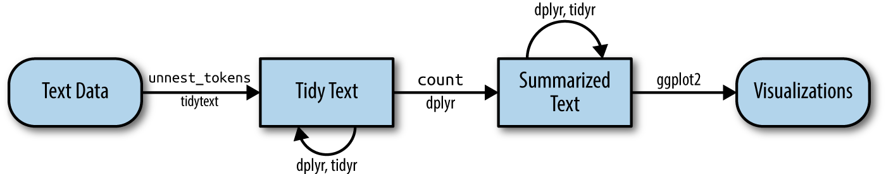
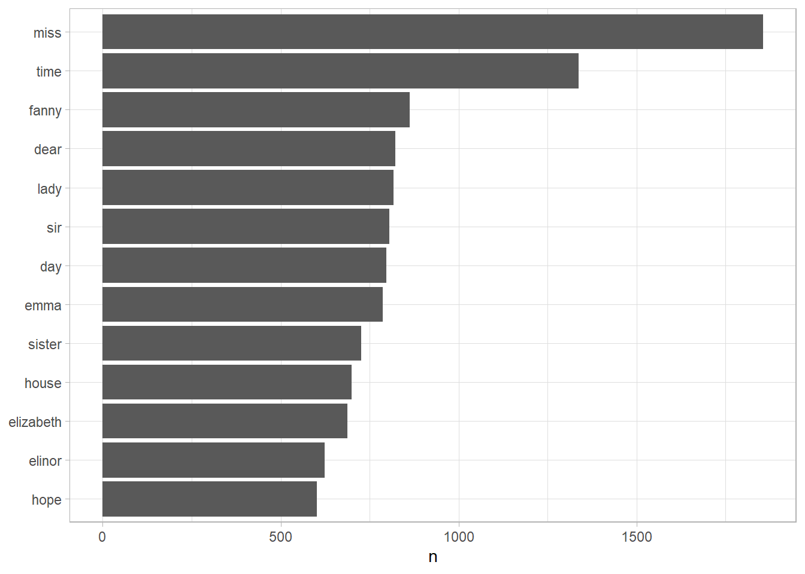

# Genotype Data {#tidytext}

1.   **Download Rice SNP data from SNP-Seek (3K RG):** We utilized the 3K RG 18 million Base SNP Dataset and the 3K RG 404k Core SNP Dataset.

2.  **Align Accession IDs:** Match the accession IDs between the phenotypic and SNP datasets.

3.  **SNP Data Processing and Quality Control:** Perform data generation and quality control on the SNP data for the subset of 311 samples.

4.  **Generate Final Genotypic Dataset:** Prepare the final genotypic dataset for GWAS analysis.

## **Download Rice SNP data from SNP-Seek (3K RG)**

As we stated above, we define the tidy text format as being a table with **one-token-per-row.** Structuring text data in this way means that it conforms to tidy data principles and can be manipulated with a set of consistent tools. This is worth contrasting with the ways text is often stored in text mining approaches.

-   **String**: Text can, of course, be stored as strings, i.e., character vectors, within R, and often text data is first read into memory in this form.
-   **Corpus**: These types of objects typically contain raw strings annotated with additional metadata and details.
-   **Document-term matrix**: This is a sparse matrix describing a collection (i.e., a corpus) of documents with one row for each document and one column for each term. The value in the matrix is typically word count or tf-idf (see Chapter \@ref(tfidf)).

Let's hold off on exploring corpus and document-term matrix objects until Chapter \@ref(dtm), and get down to the basics of converting text to a tidy format.

## **Align Accession IDs**

Emily Dickinson wrote some lovely text in her time.


``` r
text <- c("Because I could not stop for Death -",
          "He kindly stopped for me -",
          "The Carriage held but just Ourselves -",
          "and Immortality")

text
#> [1] "Because I could not stop for Death -"  
#> [2] "He kindly stopped for me -"            
#> [3] "The Carriage held but just Ourselves -"
#> [4] "and Immortality"
```

This is a typical character vector that we might want to analyze. In order to turn it into a tidy text dataset, we first need to put it into a data frame.


``` r
library(dplyr)
text_df <- tibble(line = 1:4, text = text)

text_df
#> # A tibble: 4 × 2
#>    line text                                  
#>   <int> <chr>                                 
#> 1     1 Because I could not stop for Death -  
#> 2     2 He kindly stopped for me -            
#> 3     3 The Carriage held but just Ourselves -
#> 4     4 and Immortality
```

What does it mean that this data frame has printed out as a "tibble"? A tibble is a modern class of data frame within R, available in the dplyr and tibble packages, that has a convenient print method, will not convert strings to factors, and does not use row names. Tibbles are great for use with tidy tools.

Notice that this data frame containing text isn't yet compatible with tidy text analysis, though. We can't filter out words or count which occur most frequently, since each row is made up of multiple combined words. We need to convert this so that it has **one-token-per-document-per-row**.

<div class="rmdnote">
<p>A token is a meaningful unit of text, most often a word, that we are
interested in using for further analysis, and tokenization is the
process of splitting text into tokens.</p>
</div>

In this first example, we only have one document (the poem), but we will explore examples with multiple documents soon.

Within our tidy text framework, we need to both break the text into individual tokens (a process called *tokenization*) *and* transform it to a tidy data structure. To do this, we use tidytext's `unnest_tokens()` function.


``` r
library(tidytext)

text_df %>%
  unnest_tokens(word, text)
#> # A tibble: 20 × 2
#>     line word   
#>    <int> <chr>  
#>  1     1 because
#>  2     1 i      
#>  3     1 could  
#>  4     1 not    
#>  5     1 stop   
#>  6     1 for    
#>  7     1 death  
#>  8     2 he     
#>  9     2 kindly 
#> 10     2 stopped
#> # ℹ 10 more rows
```

dard set of tidy tools, namely dplyr, tidyr, and ggplot2, as shown in Figure \@ref(fig:tidyflow-ch1).

<div class="figure" style="text-align: center">

<p class="caption">(\#fig:tidyflow-ch1)A flowchart of a typical text analysis using tidy data principles. This chapter shows how to summarize and visualize text using these tools.</p>
</div>

## **SNP Data Processing and Quality Control** {#tidyausten}

Let's use the text of Jane Austen's 6 completed, published novels from the [janeaustenr](https://cran.r-project.org/package=janeaustenr) package [@R-janeaustenr], and transform them into a tidy format. The janeaustenr package provides these texts in a one-row-per-line format, where a line in this context is analogous to a literal printed line in a physical book. Let’s start with that, and also use `mutate()` to annotate a `linenumber` quantity to keep track of lines in the original format and a `chapter` (using a regex) to find where all the chapters are.


``` r
library(janeaustenr)
library(dplyr)
library(stringr)

original_books <- austen_books() %>%
  group_by(book) %>%
  mutate(linenumber = row_number(),
         chapter = cumsum(str_detect(text, 
                                     regex("^chapter [\\divxlc]",
                                           ignore_case = TRUE)))) %>%
  ungroup()

original_books
#> # A tibble: 73,422 × 4
#>    text                    book                linenumber chapter
#>    <chr>                   <fct>                    <int>   <int>
#>  1 "SENSE AND SENSIBILITY" Sense & Sensibility          1       0
#>  2 ""                      Sense & Sensibility          2       0
#>  3 "by Jane Austen"        Sense & Sensibility          3       0
#>  4 ""                      Sense & Sensibility          4       0
#>  5 "(1811)"                Sense & Sensibility          5       0
#>  6 ""                      Sense & Sensibility          6       0
#>  7 ""                      Sense & Sensibility          7       0
#>  8 ""                      Sense & Sensibility          8       0
#>  9 ""                      Sense & Sensibility          9       0
#> 10 "CHAPTER 1"             Sense & Sensibility         10       1
#> # ℹ 73,412 more rows
```

To work with this as a tidy dataset, we need to restructure it in the **one-token-per-row** format, which as we saw earlier is done with the `unnest_tokens()` function.


``` r
library(tidytext)
tidy_books <- original_books %>%
  unnest_tokens(word, text)

tidy_books
#> # A tibble: 725,055 × 4
#>    book                linenumber chapter word       
#>    <fct>                    <int>   <int> <chr>      
#>  1 Sense & Sensibility          1       0 sense      
#>  2 Sense & Sensibility          1       0 and        
#>  3 Sense & Sensibility          1       0 sensibility
#>  4 Sense & Sensibility          3       0 by         
#>  5 Sense & Sensibility          3       0 jane       
#>  6 Sense & Sensibility          3       0 austen     
#>  7 Sense & Sensibility          5       0 1811       
#>  8 Sense & Sensibility         10       1 chapter    
#>  9 Sense & Sensibility         10       1 1          
#> 10 Sense & Sensibility         13       1 the        
#> # ℹ 725,045 more rows
```

This function uses the [tokenizers](https://github.com/ropensci/tokenizers) package to separate each line of text in the original data frame into tokens. The default tokenizing is for words, but other options include characters, n-grams, sentences, lines, paragraphs, or separation around a regex pattern.

Now that the data is in one-word-per-row format, we can manipulate it with tidy tools like dplyr. Often in text analysis, we will want to remove stop words; stop words are words that are not useful for an analysis, typically extremely common words such as "the", "of", "to", and so forth in English. We can remove stop words (kept in the tidytext dataset `stop_words`) with an `anti_join()`.


``` r
data(stop_words)

tidy_books <- tidy_books %>%
  anti_join(stop_words)
```

The `stop_words` dataset in the tidytext package contains stop words from three lexicons. We can use them all together, as we have here, or `filter()` to only use one set of stop words if that is more appropriate for a certain analysis.

We can also use dplyr's `count()` to find the most common words in all the books as a whole.


``` r
tidy_books %>%
  count(word, sort = TRUE) 
#> # A tibble: 13,914 × 2
#>    word       n
#>    <chr>  <int>
#>  1 miss    1855
#>  2 time    1337
#>  3 fanny    862
#>  4 dear     822
#>  5 lady     817
#>  6 sir      806
#>  7 day      797
#>  8 emma     787
#>  9 sister   727
#> 10 house    699
#> # ℹ 13,904 more rows
```

Because we've been using tidy tools, our word counts are stored in a tidy data frame. This allows us to pipe this directly to the ggplot2 package, for example to create a visualization of the most common words (Figure \@ref(fig:plotcount)).


``` r
library(ggplot2)

tidy_books %>%
  count(word, sort = TRUE) %>%
  filter(n > 600) %>%
  mutate(word = reorder(word, n)) %>%
  ggplot(aes(n, word)) +
  geom_col() +
  labs(y = NULL)
```

<div class="figure" style="text-align: center">

<p class="caption">(\#fig:plotcount)The most common words in Jane Austen's novels</p>
</div>

Note that the `austen_books()` function started us with exactly the text we wanted to analyze, but in other cases we may need to perform cleaning of text data, such as removing copyright headers or formatting. You'll see examples of this kind of pre-processing in the case study chapters, particularly Chapter \@ref(pre-processing-text).

## **Generate Final Genotypic Dataset**

Now that we've used the janeaustenr package to explore tidying text, let's introduce the [gutenbergr](https://github.com/ropensci/gutenbergr) package [@R-gutenbergr]. The gutenbergr package provides access to the public domain works from the [Project Gutenberg](https://www.gutenberg.org/) collection. The package includes tools both for downloading books (stripping out the unhelpful header/footer information), and a complete dataset of Project Gutenberg metadata that can be used to find works of interest. In this book, we will mostly use the function `gutenberg_download()` that downloads one or more works from Project Gutenberg by ID, but you can also use other functions to explore metadata, pair Gutenberg ID with title, author, language, etc., or gather information about authors.

<div class="rmdtip">
<p>To learn more about gutenbergr, check out the <a
href="https://docs.ropensci.org/gutenbergr/">package’s documentation at
rOpenSci</a>, where it is one of rOpenSci’s packages for data
access.</p>
</div>

## Summary

In this chapter, we explored what we mean by tidy data when it comes to text, and how tidy data principles can be applied to natural language processing. When text is organized in a format with one token per row, tasks like removing stop words or calculating word frequencies are natural applications of familiar operations within the tidy tool ecosystem. The one-token-per-row framework can be extended from single words to n-grams and other meaningful units of text, as well as to many other analysis priorities that we will consider in this book.
