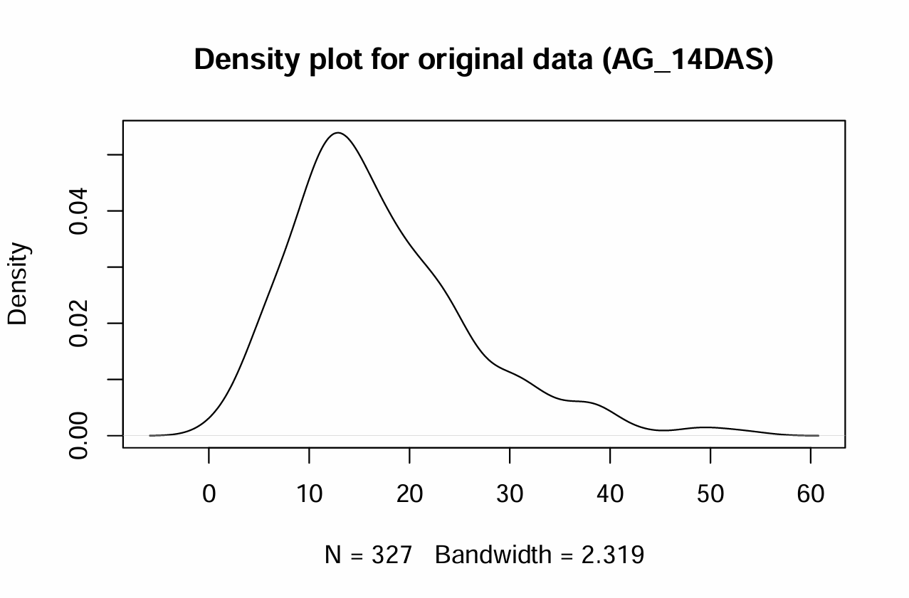
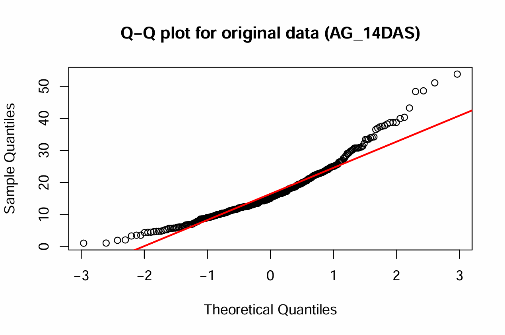
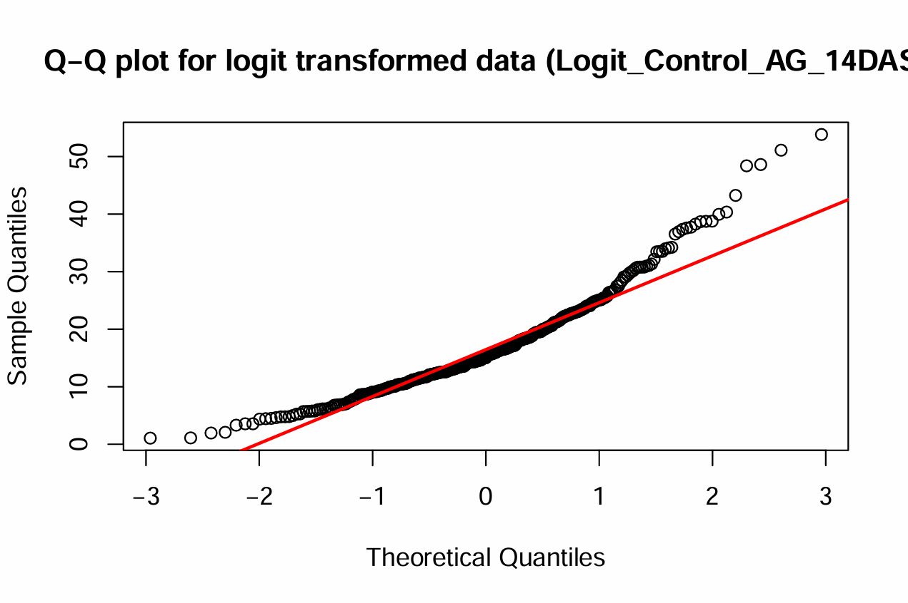
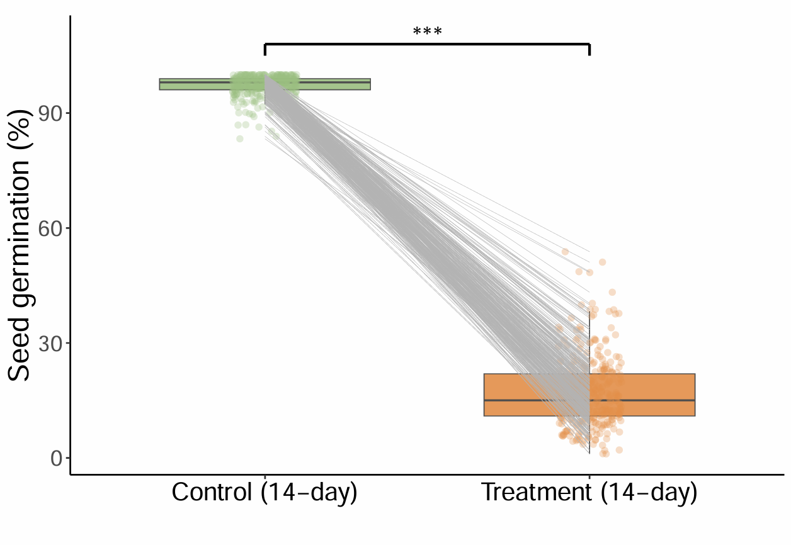
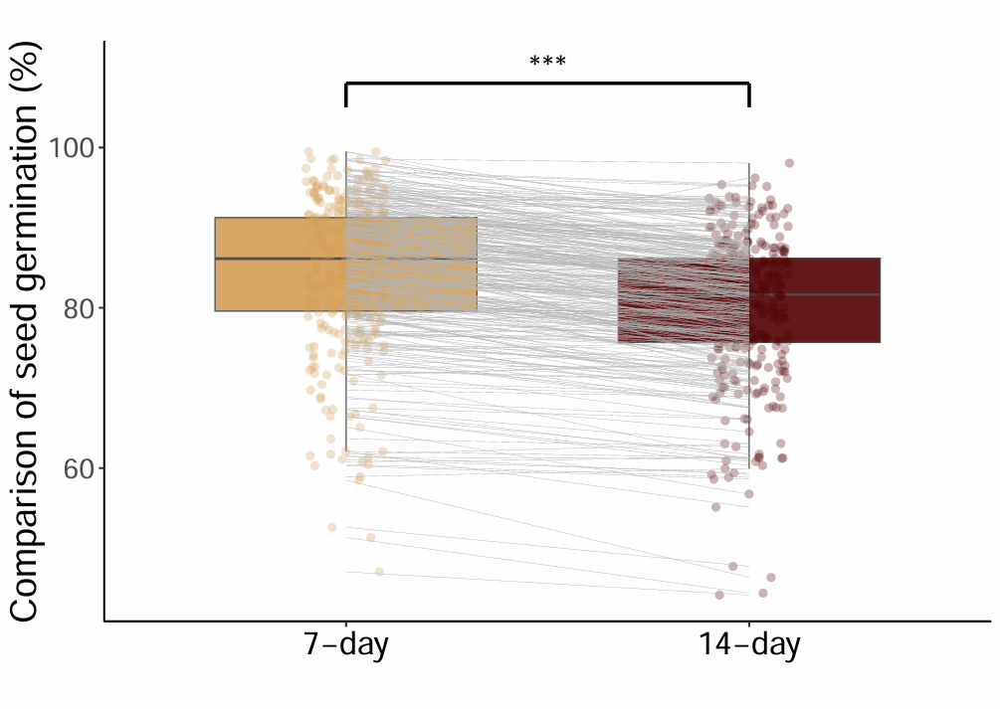

# Phenotype Data {#sec-phenotype-data}

<div class="rmdtip">
<p>In this chapter, we explore the phenotypic data that will be used
alongside the genotypic data for GWAS. We start by examining descriptive
statistics, identifying difference, and implementing transformation to
handle non-normal data. We then finalize the phenotype dataset by
selecting three traits. The outcome is a curated phenotypic dataset,
ready for integration with the genotype data in subsequent analyses.</p>
</div>

1.  **Phenotypic Data Processing**

2.  **Phenotypic Data Visualization**

3.  **Prepare Final Phenotypic Data**

## **Phenotypic Data Processing**

We aim to process and clean phenotypic data for a dataset called
**Pheno_327_ranked**. This dataset contains measurements of various
phenotypic traits collected under different experimental conditions,
including controls and treatments at specified time intervals (e.g., 5,
7, and 14 days under control or treatment).

We focus on exploring and transforming phenotypic data to achieve
normality, which is essential for many statistical analyses, including
GWAS. The dataset being processed (i.e. logit transformation) contains
phenotypic measurements, specifically the variable `Control_AG_14DAS`,
representing the difference between control and treatment phenotypes at
14 days after sowing.

<details>

<summary>**R** ➡️ **Exploring** **Phenotypic Data**</summary>

``` r
##### R CODES #####

# Set the working directory
setwd("...your file path...")

# Load the phenotype data
Pheno_data = read.csv("Pheno_327_ranked.csv")

# Check normality of the original data
data = Pheno_data$AG.14
shapiro.test(data) 
summary(data)
# Calculate skewness to assess data symmetry
library(moments)
skewness(data)
# Negative (positive) skewness indicates a left (right) skew
# Plot the density of the original data
plot(density(data), main = "Density plot for original data (Control_AG_14DAS)")
# Create a Q-Q plot to visually check normality of the original data
qqnorm(data, main = "Q-Q plot for original data (Control_AG_14DAS)")
qqline(data, col = "red", lwd = 2)

# Apply logit transformation to normalize the data
# The logit transformation is commonly used to transform probabilities (values between 0 and 1) into the real number line.
logit = function(p) {
  epsilon = 3e-4
  p = ifelse(p == 0, epsilon, ifelse(p == 1, 1 - epsilon, p))
  log(p / (1 - p))
}
# AG under 14 days
data_AG_14 = logit(Pheno_data$AG.14/100)
data_Control_14 = logit(Pheno_data$N.14/100)
Logit_Control_AG_14DAS = data_Control_14 - data_AG_14
  
shapiro.test(Logit_Control_AG_14DAS)
skewness(Logit_Control_AG_14DAS)
plot(density(Logit_Control_AG_14DAS), main="Density plot for logit transformed data (Logit_Control_AG_14DAS)")
qqnorm(data, main = "Q-Q plot for logit transformed data (Logit_Control_AG_14DAS)")
qqline(data, col = "red", lwd = 2)
```

-   **AG_14DAS:**

    {width="400"}

    {width="400"}

-   **Control_AG_14DAS:**

    {width="400"}

    {width="400"}

-   **Logit_Control_AG_14DAS:**

    {width="400"}

    {width="400"}

</details>

We use the **logit-transformed data (Logit_Control_AG_14DAS)** along
with the original data (**AG_14DAS & Control_AG_14DAS**) for GWAS
analysis.

------------------------------------------------------------------------

## **Phenotypic Data Visualization**

We aim to analyze and visualize seed germination data under various
experimental conditions. This analysis is centered around comparing
control and treatment groups at different time points (7 and 14 days) to
assess the effects of treatments on seed germination rates.

**Welch's t-tests** are conducted to compare seed germination rates
between:

-   Control and treatment groups at 7 days.

-   Control and treatment groups at 14 days.

-   Comparison of seed germination at 7 days versus 14 days.

<details>

<summary>**R** ➡️ **Phenotypic Data Visualization**</summary>

``` r
##### R CODES #####

# Set the working directory
setwd("...your file path...")

# Load the phenotype data
Pheno_data = read.csv("Pheno_327_ranked.csv")

# Load ggplot2 library for data visualization
library(ggplot2)

# Seed germination analysis: Control vs Treatment (7-day)
Group1 = Pheno_data$N.7
Group2 = Pheno_data$AG.7

# Perform Welch Two Sample t-test
t.test(Group1, Group2) # p-value < 2.2e-16

# Create a data frame for visualization
ID = Pheno_data$DNA_ID
data = data.frame(
  value = c(Group1, Group2),
  group = rep(c("Control_7", "Treatment_7"), each = length(Group1)),
  id = rep(ID, 2))

# Generate boxplot and jitter plot for 7-day seed germination
ggplot(data, aes(x = group, y = value, group = group)) +
  geom_boxplot(aes(fill = group), color = "grey30", width = 0.65, size = 0.3, alpha = 0.9, outlier.shape = NA) +
  geom_jitter(width = 0.1, aes(color = group), size = 1.5, alpha = 0.3) +
  geom_line(aes(group = id), color = "grey70", size = 0.1) +
  theme_classic() +
  labs(title = "", x = "", y = "Seed germination (%)") +
  theme(
    axis.title.x = element_text(size = 18),
    axis.title.y = element_text(size = 18),
    axis.text.x = element_text(size = 16, color = "black"),
    axis.text.y = element_text(size = 14),
    legend.position = "none") +
  scale_fill_manual(values = c("Control_7" = "#9ABF80", "Treatment_7" = "#E38E49")) +
  scale_color_manual(values = c("Control_7" = "#9ABF80", "Treatment_7" = "#E38E49")) +
  scale_x_discrete(labels = c("Control_7" = "Control (7-day)", "Treatment_7" = "Treatment (7-day)")) +
  annotate("segment", x = 1, xend = 2, y = 108, yend = 108, linewidth = 0.8, color = "black") +
  annotate("segment", x = 1, xend = 1, y = 108, yend = 105, linewidth = 0.8, color = "black") +
  annotate("segment", x = 2, xend = 2, y = 108, yend = 105, linewidth = 0.8, color = "black") +
  annotate("text", x = 1.5, y = 110, label = paste("***"), size = 6, hjust = 0.5) # 5 x 5

# Seed germination analysis: Control vs Treatment (14-day)
Group1 = Pheno_data$N.14
Group2 = Pheno_data$AG.14

# Perform Welch Two Sample t-test
t.test(Group1, Group2) # p-value < 2.2e-16

# Create a data frame for visualization
data = data.frame(
  value = c(Group1, Group2),
  group = rep(c("Control_14", "Treatment_14"), each = length(Group1)),
  id = rep(ID, 2))

# Generate boxplot and jitter plot for 14-day seed germination
ggplot(data, aes(x = group, y = value, group = group)) +
  geom_boxplot(aes(fill = group), color = "grey30", width = 0.65, size = 0.3, alpha = 0.9, outlier.shape = NA) +
  geom_jitter(width = 0.1, aes(color = group), size = 1.5, alpha = 0.3) +
  geom_line(aes(group = id), color = "grey70", size = 0.1) +
  theme_classic() +
  labs(title = "", x = "", y = "Seed germination (%)") +
  theme(
    axis.title.x = element_text(size = 18),
    axis.title.y = element_text(size = 18),
    axis.text.x = element_text(size = 16, color = "black"),
    axis.text.y = element_text(size = 14),
    legend.position = "none") +
  scale_fill_manual(values = c("Control_14" = "#9ABF80", "Treatment_14" = "#E38E49")) +
  scale_color_manual(values = c("Control_14" = "#9ABF80", "Treatment_14" = "#E38E49")) +
  scale_x_discrete(labels = c("Control_14" = "Control (14-day)", "Treatment_14" = "Treatment (14-day)")) +
  annotate("segment", x = 1, xend = 2, y = 108, yend = 108, linewidth = 0.8, color = "black") +
  annotate("segment", x = 1, xend = 1, y = 108, yend = 105, linewidth = 0.8, color = "black") +
  annotate("segment", x = 2, xend = 2, y = 108, yend = 105, linewidth = 0.8, color = "black") +
  annotate("text", x = 1.5, y = 110, label = paste("***"), size = 6, hjust = 0.5) # 5 x 5

# Comparison of seed germination between Control groups (7-day vs 14-day)
Group1 = Pheno_data$NminusAG.7
Group2 = Pheno_data$NminusAG.14

# Perform Welch Two Sample t-test
t.test(Group1, Group2) # p-value = 7.493e-10

# Create a data frame for visualization
data = data.frame(
  value = c(Group1, Group2),
  group = rep(c("Group1", "Group2"), each = length(Group1)),
  id = rep(ID, 2))

# Generate boxplot and jitter plot for comparison
ggplot(data, aes(x = group, y = value, group = group)) +
  geom_boxplot(aes(fill = group), color = "grey30", width = 0.65, size = 0.3, alpha = 0.9, outlier.shape = NA) +
  geom_jitter(width = 0.1, aes(color = group), size = 1.5, alpha = 0.3) +
  geom_line(aes(group = id), color = "grey70", size = 0.1) +
  theme_classic() +
  labs(title = "", x = "", y = "Comparison of seed germination (%)") +
  theme(
    axis.title.x = element_text(size = 18),
    axis.title.y = element_text(size = 18),
    axis.text.x = element_text(size = 16, color = "black"),
    axis.text.y = element_text(size = 14),
    legend.position = "none") +
  scale_fill_manual(values = c("Group1" = "#D39D55", "Group2" = "#500000")) +
  scale_color_manual(values = c("Group1" = "#D39D55", "Group2" = "#500000")) +
  scale_x_discrete(labels = c("Group1" = "7-day", "Group2" = "14-day")) +
  annotate("segment", x = 1, xend = 2, y = 108, yend = 108, linewidth = 0.8, color = "black") +
  annotate("segment", x = 1, xend = 1, y = 108, yend = 105, linewidth = 0.8, color = "black") +
  annotate("segment", x = 2, xend = 2, y = 108, yend = 105, linewidth = 0.8, color = "black") +
  annotate("text", x = 1.5, y = 110, label = paste("***"), size = 6, hjust = 0.5) # 5 x 5
```

1.  Seed germination on measurement under control and treatment (7-day)

    {width="500"}

2.  Seed germination on measurement under control and treatment (14-day)

    {width="500"}

3.  Comparison of seed germination

    {width="500"}

</details>

------------------------------------------------------------------------

## **Prepare Final Phenotypic Data**

We generate the final phenotypic data for GWAS analysis. The resulting
`Pheno` object is optimized for seamless use in GWAS workflows.

<details>

<summary>**R ➡️ Generating final phenotypic data**</summary>

``` r
##### R CODES #####

# Set the working directory
setwd("...your file path...")

# Read the cleaned and sorted phenotypic data from a CSV file
Pheno_327_ranked = read.csv("Pheno_327_ranked.csv")

# Create a new data frame with selected columns and a modified Taxa column
Pheno = data.frame(Taxa = paste(Pheno_327_ranked$DNA_ID, Pheno_327_ranked$DNA_ID, sep = "_"),
                   AG_14DAS = Pheno_327_ranked$AG.14,
                   Control_AG_14DAS = Pheno_327_ranked$NminusAG.14,
                   Logit_Control_AG_14DAS = Pheno_327_ranked$logitDiffN_AG.14)

# Save the new data frame as an RDS file for future use
saveRDS(Pheno, "Pheno.rds") # Final data
```

**Outputs:**

-   **Pheno.rds**\
    Phenotypic dataset in ‘data.frame’ format stored in `.rds` file.
    Ready for GWAS.

</details>

------------------------------------------------------------------------

## Summary

We have prepared a phenotypic dataset specifically designed for GWAS
analysis, which includes the following four traits:

-   **AG_14DAS**: Seed germination rates under treatment conditions at
    14 days.

-   **Control_AG_14DAS**: The difference in seed germination rates
    between control and treatment groups at 14 days.

-   **Logit_Control_AG_14DAS**: Log-transformed data of the difference
    in seed germination rates between control and treatment groups at 14
    days.
